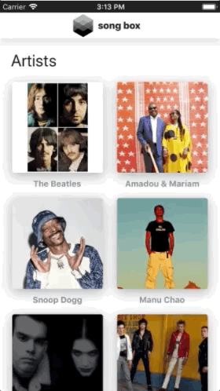
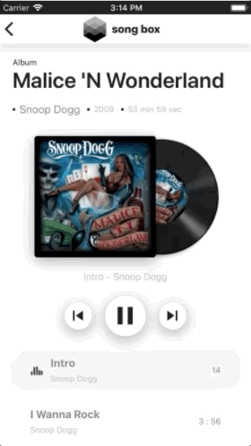
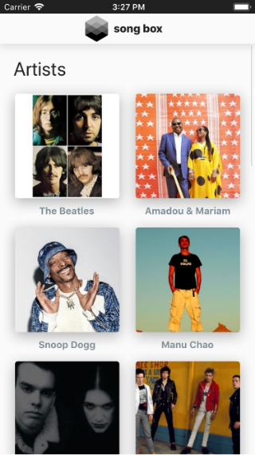
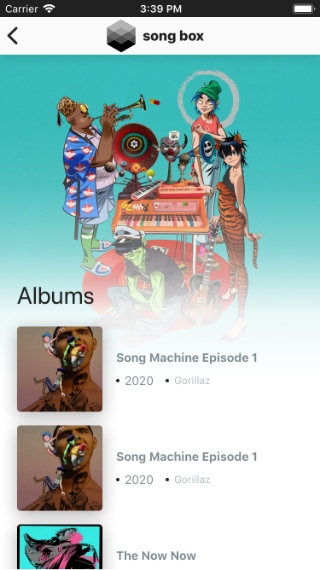
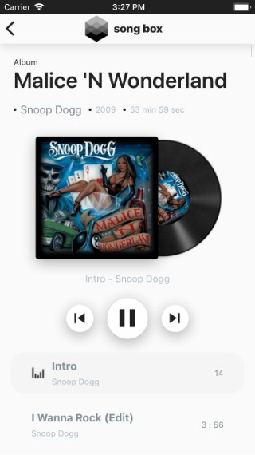

<h4>JavaScrip | React Native</h4>

O song box é um app de música em streaming e sua principal funcionalidade é a reprodução de faixas de álbuns através do consumo da api pública do Deezer. Com o mesmo aprimorei meus conhecimentos, com relação ao consumo e reprodução de conteúdos multimídia e com animações, no React Native.

 _&nbsp;&nbsp;_   _&nbsp;&nbsp;_ 

  
  _&nbsp;&nbsp;  _&nbsp;&nbsp;_   _&nbsp;&nbsp;_ 

